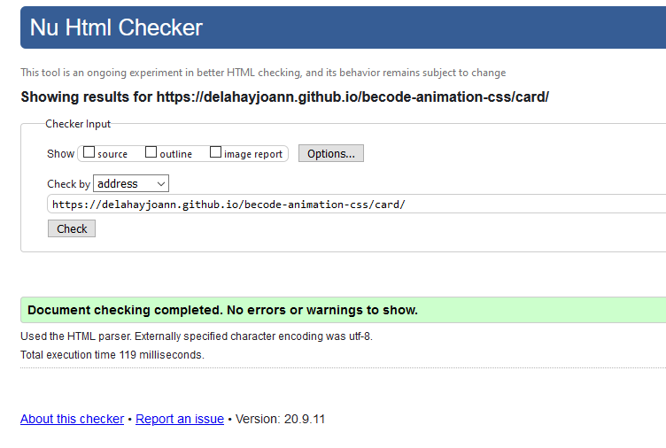

# Animation CSS

## Quoi?
Réaliser des animations en utilisant la propriété css transition.

## Pourquoi?
Apprentissage lors de la formation BeCode

## Comment?
__PAS DE JAVASCRIPT__  
En utilisant exclusivement la propriété transition et le :hover 

## Quand ressort-il?
Actuellement, seul Firefox permet d'animer le redimensionnement de la taille des rows ou columns dans un Grid.
Les autres navigateurs ne feront aucune transition. Les changements seront immédiats pour le redimensionnement de Grid.
J'ai été obligé de tout modifier pour passer sur du Flexbox.

[__Résultat pour le Drill__](https://delahayjoann.github.io/becode-animation-css/drill/) 
[__Résultat pour la Card__](https://delahayjoann.github.io/becode-animation-css/card/)

## W3C Validator

